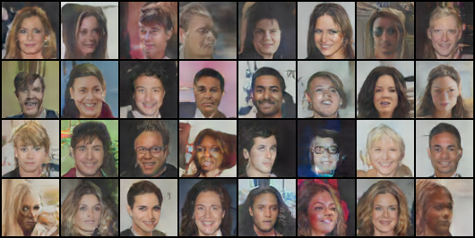
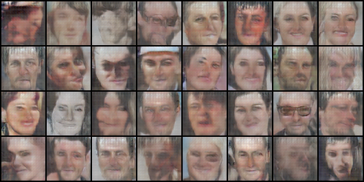
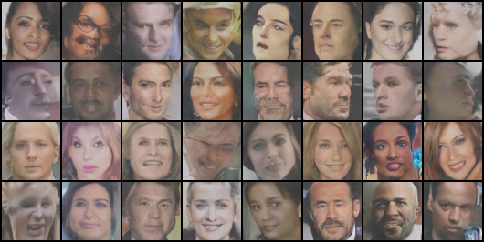

# DCGAN implementation using pytorch with celebA dataset
## Reference
- Paper: Unsupervised Representation Learning with Deep Convolutional Generative Adversarial Networks
    - [arxiv](https://arxiv.org/pdf/1511.06434.pdf)
- Pytorch DCGAN Example: [github](https://github.com/pytorch/examples/tree/master/dcgan)
- CelebA Dataset: http://mmlab.ie.cuhk.edu.hk/projects/CelebA.html
    - We will use the img_align_celeba dataset.
## Usage
- python GAN.py --dataset_dir='dataset dir' --result_dir='result dir'
    - example: python GAN.py --dataset_dir=./celeba --result_dir=./celeba_result
- dataset example
    - ./celeba/celeba/000000.jpg
    - ./celeba/celeba/000001.jpg
    - ...
## Result
LS-GAN(use MSE loss) celeba 20 epoch result

DC-GAN(use BCE loss) VGGFace2 20 epoch result

LS-GAN VGGFace2 20 epoch result

